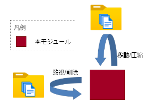
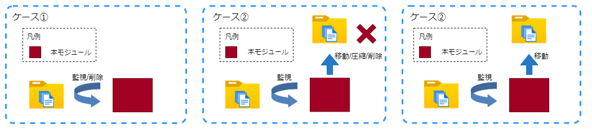

# FileCleaner

## 目次
* [概要](#概要)
* [機能](#機能)
  * [※経過時間の判定方法について](#JudgeMethod)
* [Quick Start](#quick-start)
* [イメージのURL](#イメージのurl)
* [動作保証環境](#動作保証環境)
* [Deployment 設定値](#deployment-設定値)
  * [環境変数](#環境変数)
  * [Desired Properties](#desired-properties)
  * [Create Option](#create-option)
* [受信メッセージ](#受信メッセージ)
* [送信メッセージ](#送信メッセージ)
  * [Message Body](#message-body)
  * [Message Properties](#message-properties)
* [Direct Method](#direct-method)
* [ログ出力内容](#ログ出力内容)
* [ユースケース](#ユースケース)
  * [ケース ①](#Usecase1)
  * [ケース ②](#Usecase2)
  * [ケース ③](#Usecase3)
* [Feedback](#feedback)
* [LICENSE](#license)

## 概要
FileCleanerは、フォルダ/ファイルを監視し、移動/削除/圧縮を起動時間、一定間隔で実行するAzure IoT edgeモジュールです。

## 機能

* フォルダ/ファイルを監視し、移動/削除/圧縮を起動時間、定間隔で実行する



<a id="JudgeMethod"></a>

### ※経過時間の判定方法について

* "update_time"の場合

  現在日時から設定された経過時間をマイナスした日時 >= ファイルの更新日時 の場合に対象とする<br>
  例) "day"=1 "hour"=6、現在日時が「2020/10/20 14:00:00」の場合、<br>
  「2020/10/19 8:00:00」>= ファイルの更新日時 の場合対象<br>

<br>

* "name_prefix"の場合
  * ファイルの先頭8文字が、指定された日付形式("yyyyMMdd"形式等)で日付に変換可能な物が対象
  * 現在日時から設定された経過時間をマイナスした日時の年月日 >= ファイルの先頭文字 の場合に対象とする<br>
    例) "hour"=12、現在日時が「2020/10/20 14:00:00」の場合、<br>
    判定日時「2020/10/20 2:00:00」<br>
    → ファイルの先頭文字が"20201020"以前のファイルが対象<br>
    "day"=1、 現在日時が「2020/10/20 14:00:00」の場合、<br>
    判定日時「2020/10/19 14:00:00」<br>
    → ファイルの先頭文字が"20201019"以前のファイルが対象<br>

## Quick Start
1. Personal Accese tokenを作成
（参考: [個人用アクセス トークンを管理する](https://docs.github.com/ja/authentication/keeping-your-account-and-data-secure/managing-your-personal-access-tokens)）

2. リポジトリをクローン
```
git clone https://github.com/Project-GAUDI/FileCleaner.git
```

3. ./src/nuget_template.configの<GITHUB_USERNAME>と<PERSONAL_ACCESS_TOKEN>を自身のユーザー名とPersonal Accese tokenに書き換えて、ファイル名をnuget.configに変更してください

4. Dockerイメージをビルド
```
docker image build -t <IMAGE_NAME> ./FileCleaner/src/
```
例）
```
docker image build -t ghcr.io/<YOUR_GITHUB_USERNAME>/filecleaner:<VERSION> ./FileCleaner/src/
```

5. Dockerイメージをコンテナレジストリにプッシュ
```
docker push <IMAGE_NAME>
```
例）
```
docker push ghcr.io/<YOUR_GITHUB_USERNAME>/filecleaner:<VERSION>
```

6. Azure IoT edgeで利用

## イメージのURL
準備中

| URL                                                         | Description         |
| ----------------------------------------------------------- | ------------------- |

## 動作保証環境

| Module Version | IoTEdge | edgeAgent | edgeHub  | amd64 verified on | arm64v8 verified on | arm32v7 verified on |
| -------------- | ------- | --------- | -------- | ----------------- | ------------------- | ------------------- |
| 4.0.2          | 1.4.27  | 1.4.27    | 1.4.27   | ubuntu20.04       | －                  | －                  |


## Deployment 設定値

### 環境変数

#### 環境変数の値

| Key               | Required | Default       | Description                                                                               |
| ----------------- | -------- | ------------- | ----------------------------------------------------------------------------------------- |
| TZ                |          | UTC           | コンテナのタイムゾーン。                                    |
| TransportProtocol |          | Amqp          | ModuleClientの接続プロトコル。<br>["Amqp", "Mqtt"]                        |
| LogLevel          |          | info          | 出力ログレベル。<br>["trace", "debug", "info", "warn", "error"]       |
| M2MqttFlag        |          | false         | 通信に利用するAPIの切り替えフラグ。<br>false ： IoTHubトピックのみ利用可能。<br>true ： IoTHubトピックとMqttトピックが利用可能。ただし、SasTokenの発行と設定が必要。|
| SasToken          | △       |               | M2MqttFlag=true時必須。edgeHubと接続する際に必要なモジュール毎の署名。                                      |

### Desired Properties

#### Desired Properties の値

| JSON Key                           | Type    | Required | Default          | Description                                                                                                                                                                                                                                |
| ---------------------------------- | ------- | -------- | ---------------- | ------------------------------------------------------------------------------------------------------------------------------------------------------------------------------------------------------------------------------------------ |
| info[x]                            | object  | 〇       |                  | [x]は連番の数字。                                                                                                                                                                                                                            |
| &nbsp; job_name                    | string  |          | null             | jobのID(ログに出力されるのみ)。                                                                                                                                                                                                              |
| &nbsp; timezone                    | string  |          | "UTC"            | 起動スケジュールのタイムゾーン設定。                                                                                                                                                                                                         |
| &nbsp; second                      | string  | 〇       |                  | 秒(cron式)。                                                                                                                                                                                                                                 |
| &nbsp; minute                      | string  | 〇       |                  | 分(cron式)。                                                                                                                                                                                                                                 |
| &nbsp; hour                        | string  | 〇       |                  | 時(cron式)。                                                                                                                                                                                                                                 |
| &nbsp; day                         | string  | 〇       |                  | 日(cron式)。                                                                                                                                                                                                                                 |
| &nbsp; month                       | string  | 〇       |                  | 月(cron式)。                                                                                                                                                                                                                                 |
| &nbsp; week                        | string  | 〇       |                  | 週(cron式)。                                                                                                                                                                                                                                 |
| &nbsp; mode                        | string  | 〇       |                  | 実行モード (以下のいずれかを指定)。<br>①"delete"：削除<br>②"compress"：圧縮(zipのみ)<br>③"compress_and_delete"：圧縮して削除<br>④"move"：移動                                                                                                |
| &nbsp; target_type                 | string  | 〇       |                  | ①"file"⇒ファイルを対象とする<br>②"directory" ：ディレクトリを対象とする                                                                                                                                                                    |
| &nbsp; search_option               | string  |          | TopDirectoryOnly | 検索時のオプション(以下のいずれかを指定)。<br>①"TopDirectoryOnly"：入力ディレクトリ直下のみ検索<br>②"AllDirectories"：サブディレクトリも含めて検索                                                                                           |
| &nbsp; move_overwrite              | boolean |          | true             | 移動時、移動先に同名ファイル(orディレクトリ)が存在する場合に上書きするかどうか。<br>\*falseを指定していた場合は、移動先に同名ファイルが存在すると例外が発生する。                                                                             |
| &nbsp; input_path                  | string  |          | null             | 対象(ファイルorディレクトリ)を検索するディレクトリ。                                                                                                                                                                                         |
| &nbsp; output_path                 | string  |          | null             | 移動先 or 圧縮ファイル保存先ディレクトリ。<br>\*modeが「移動」または「圧縮」の場合は必須。<br>\*modeが「移動」の場合、input_pathと同じ場合はエラー。<br>\*modeが「圧縮」の場合、input_pathと同じでもOK。                                           |
| &nbsp; comp_workpath               | string  |          | null             | 圧縮時に使用するワークディレクトリ。<br>\*modeが「圧縮」の場合は必須。<br>\*input_path or output_pathと同じ場合はエラー。                                                                                                                        |
| &nbsp; regex_pattern               | string  |          | null             | 対象とするファイル名orディレクトリ名のパターン(正規表現)。                                                                                                                                                                                   |
| &nbsp; elapsed_time                | string  |          | null             | 対象とする経過日数を指定。                                                                                                                                                                                                                   |
| &nbsp; &nbsp; judge_type           | object  |          | null             | 判定条件 (以下のいずれかを指定) 。<br>①"update_time"：ファイルの更新日時で判定<br>②"name_prefix"：ファイル名先頭文字(yyyyMMdd等)で判定<br>③"name_regex"：ファイル名パターン正規表現のグループ名から取得した値で判定                          |
| &nbsp; &nbsp; group_name           | string  |          | null             | typeが"name_regex"の場合に指定。                                                                                                                                                                                                             |
| &nbsp; &nbsp; date_format          | string  |          | "yyyyMMdd"       | typeが"name_prefix"、"name_regex"の場合に指定。                                                                                                                                                                                              |
| &nbsp; &nbsp; day                  | number  |          | 0                | 経過時間(日)<br>\*day or hour or minute or second のどれかまたは複数を指定可。                                                                                                                                                               |
| &nbsp; &nbsp; hour                 | number  |          | 0                | 経過時間(時)<br>\*day or hour or minute or second のどれかまたは複数を指定可。                                                                                                                                                               |
| &nbsp; &nbsp; minute               | number  |          | 0                | 経過時間(分)<br>\*day or hour or minute or second のどれかまたは複数を指定可。                                                                                                                                                               |
| &nbsp; &nbsp; second               | number  |          | 0                | 経過時間(秒)<br>\*day or hour or minute or second のどれかまたは複数を指定可。                                                                                                                                                               |
| &nbsp; compress_file               | object  |          | null             | 圧縮先ファイル情報。 <br>\*modeが「圧縮」の場合に設定<br>\*省略した場合、圧縮元のファイル名 or ディレクトリ名。                                                                                                                                |
| &nbsp; &nbsp; filename             | string  |          | null             | 圧縮ファイルのファイル名。<br>\*拡張子は含めない。<br>\*拡張子は固定で".zip"を付与。                                                                                                                                                             |
| &nbsp; &nbsp; replace_param[y]     | object  |          | null             | [y]は連番の数字。<br>ファイル名の置換設定。                                                                                                                                                                                                    |
| &nbsp; &nbsp; &nbsp; base_name     | string  |          | null             | 置換元文字列。                                                                                                                                                                                                                               |
| &nbsp; &nbsp; &nbsp; replace_type  | string  |          | null             | 置換先文字列のタイプを指定 (以下のいずれかを指定)。<br>①"group_name"：ファイル名パターン正規表現のグループ名から取得した値<br>②"file_date"：圧縮するファイルの更新日時<br>③"now_date"：現在日時                                              |
| &nbsp; &nbsp; &nbsp; replace_value | string  |          | null             | 置換先文字列の取得に使用。<br>①replace_typeが "group_name"…正規表現のグループ名を指定<br>②replace_typeが "file_date"…ToStringする際のformatを指定 ("yyyyMMdd" 等)<br>③replace_typeが "now_date"…ToStringする際のformatを指定 ("yyyyMMdd" 等) |

#### Desired Properties の記入例

```
{
  "info1": {
    "job_name": "val20 Backup Zip Delete",
    "timezone": "Japan",
    "second": "0",
    "minute": "0/5",
    "hour": "*",
    "day": "*",
    "month": "*",
    "week": "?",
    "mode": "delete",
    "target_type": "file",
    "input_path": "/iotedge/val20/Backup",
    "regex_pattern": "^val20-\\d{6}\\.zip$",
    "elapsed_time": {
      "judge_type": "update_time",
      "day": 365
    }
  }
}
```

### Create Option

#### Create Option の値

| JSON Key     | Type   | Required | Description              |
| ------------ | ------ | -------- | ------------------------ |
| HostConfig   | object | ○        |                          |
| &nbsp; Binds | object | ○        | ディレクトリバインド設定 |

#### Create Option の記入例

```
{
  "HostConfig": {
    "Binds": ["/var/ftp/val20/Backup:/iotedge/val20/Backup"]
  }
}
```

## 受信メッセージ

なし

## 送信メッセージ

普段はメッセージを送信しないが、モジュールのエラーが発生した場合にメッセージ送信が行われる。

### Message Body

| JSON Key     | Type   | Description |
| ------------ | ------ | ----------- |
| RecordHeader | array  |             |
| &nbsp; (1)   | string | 処理時刻    |
| RecordData   | array  | エラー内容  |

### Message Properties

| Key   | Description                |
| ----- | -------------------------- |
| type  | メッセージのタイプ ("log") |
| level | ログのレベル               |

## Direct Method

なし

## ログ出力内容

| LogLevel | 出力概要 |
| -------- | -------- |
| error    | [初期化/desired更新/desired取得/実行]失敗         |
| warn     | エッジランタイムとの接続リトライ失敗<br>環境変数の1部値不正         |
| info     | [環境変数/desired]の値<br>desired更新通知<br>環境変数の値未設定のためDefault値適用<br>desired取得成否<br>スケジューラー[開始/停止]<br>実行[開始/停止]<br>ファイルクリーナージョブ[開始/停止]         |
| debug    | ジョブ停止<br>ファイルクリーナージョブが既に稼働中メッセージ<br>処理対象が存在しない<br>ファイル圧縮すでに実行済み     |
| trace    | メソッドの開始・終了<br>[新規ジョブ/対象チェック/新規スケジュールジョブ追加]開始<br>[新規ジョブ/新規トリガー]作成<br>新規スケジュールジョブ追加終了<br>inputディレクトリ調査完了<br>対象名<br>処理日時情報<br>正規表現[マッチ/未設定]<br>対象情報<br>パス・ファイル名追加<br>処理進行<br>[ファイル/ディレクトリ]コピー<br>[ファイル/ディレクトリ]削除<br>[ファイル/ディレクトリ]移動     |

## ユースケース



<a id="Usecase1"></a>

### ケース ①

ある決まったフォルダに不定期間隔でアップロードされるファイルをファイル生成日時から一定時間経過後、削除する処理を決まった間隔で実行する。

#### desiredProperties

```
{
  "info1": {
    "job_name": "val20 Backup Zip Delete",
    "timezone": "Japan",
    "second": "0",
    "minute": "0/5",
    "hour": "*",
    "day": "*",
    "month": "*",
    "week": "?",
    "mode": "delete",
    "target_type": "file",
    "input_path": "/iotedge/val20/Backup",
    "regex_pattern": "^val20-\\d{6}\\.zip$",
    "elapsed_time": {
      "judge_type": "update_time",
      "day": 365
    }
  }
}
```

#### 環境変数

| 環境変数 | Description |
| -------- | ----------- |
| LogLevel | debug       |
| TZ       | Asia/Tokyo  |

#### Container Create Options

```
{
  "HostConfig": {
    "Binds": [
      "/var/ftp/val20/Backup:/iotedge/val20/Backup"
    ]
  }
}
```

#### 出力結果

ex.格納されるファイルと削除する条件

1. 監視対象のフォルダのパスは"/iotedge/val20/Backup"とする
2. 削除対象となるファイル名のフォーマットは以下のいずれかである

```
 Ⅰ val20-{任意の文字列(6文字)}.zip
```

3. ファイル保存日時から365日経過後、ファイルを削除する
4. 削除処理は毎日5分おきに実行する

出力結果：<br>
条件に合致するファイルが削除される

<a id="Usecase2"></a>

### ケース ②

ある決まったフォルダに不定期間隔でアップロードされるファイルをファイル生成日時から一定時間経過後、移動、圧縮、削除する処理を決まった時刻で実行する。

#### desiredProperties

```
{
  "info1": {
    "job_name": "val20 Backup CSV Compress",
    "timezone": "Japan",
    "second": "0",
    "minute": "5",
    "hour": "5",
    "day": "?",
    "month": "*",
    "week": "sun,tue-sat",
    "mode": "compress_and_delete",
    "target_type": "file",
    "input_path": "/iotedge/val20/Backup",
    "output_path": "/iotedge/val20/Backup",
    "comp_workpath": "/iotedge/val20/comp_work",
    "regex_pattern": "^TMP_005_(007|025)_(J|j)(P|p)013010043010(3|4|5|6)_.+_(?<production_date>\\d{6}?)-\\d{4}\\.(C|c)(S|s)(V|v)_*[0-9]*$",
    "elapsed_time": {
      "judge_type": "name_regex",
      "group_name": "production_date",
      "date_format": "yyMMdd",
      "day": 1
    },
    "compress_file": {
      "filename": "val20-<production_date>",
      "replace_param1": {
        "base_name": "<production_date>",
        "replace_type": "group_name",
        "replace_value": "production_date"
      }
    }
  }
}
```

#### 環境変数

| 環境変数 | Description |
| -------- | ----------- |
| LogLevel | debug       |
| TZ       | Asia/Tokyo  |

#### Container Create Options

```
{
  "HostConfig": {
    "Binds": [
      "/var/ftp/val20/Backup:/iotedge/val20/Backup",
      "/var/ftp/val20/comp_work:/iotedge/val20/comp_work"
    ]
  }
}
```

#### 出力結果

ex.格納されるファイルと圧縮・削除する条件

1. 監視対象のフォルダのパスは"/iotedge/val20/Backup"とする
2. 圧縮・削除対象となるファイル名のフォーマットは以下のいずれかである

```
 Ⅰ TMP_005_007_JP_0130100430103_{任意の文字列}_{yyMMddの日付}-{4桁の文字}.CSV
 Ⅱ TMP_005_007_JP_0130100430104_{任意の文字列}_{yyMMddの日付}-{4桁の文字}.CSV
 Ⅲ TMP_005_007_JP_0130100430105_{任意の文字列}_{yyMMddの日付}-{4桁の文字}.CSV
 Ⅳ TMP_005_007_JP_0130100430106_{任意の文字列}_{yyMMddの日付}-{4桁の文字}.CSV
 Ⅴ TMP_005_025_JP_0130100430103_{任意の文字列}_{yyMMddの日付}-{4桁の文字}.CSV
 Ⅵ TMP_005_025_JP_0130100430104_{任意の文字列}_{yyMMddの日付}-{4桁の文字}.CSV
 Ⅶ TMP_005_025_JP_0130100430105_{任意の文字列}_{yyMMddの日付}-{4桁の文字}.CSV
 Ⅷ TMP_005_025_JP_0130100430106_{任意の文字列}_{yyMMddの日付}-{4桁の文字}.CSV
 Ⅸ Ⅰ～Ⅷのファイル拡張子".CSV"の後に"_{任意の数値}"を付与したファイル名
 Ⅹ Ⅰ～Ⅸの"JP"の一部または全てが小文字のパターン
 XI Ⅰ～Ⅹの"CSV"の一部または全てが小文字のパターン
```

3. 圧縮したファイルの移動先のフォルダのパスは"/iotedge/val20/Backup"とする
4. 圧縮を行うために一時的に格納するフォルダのパスは"/iotedge/val20/comp_work"とする
5. 圧縮単位は日単位とする
6. 圧縮後のファイル名は"val20-{yyMMddの日付}.zip"とする
7. 圧縮・削除処理は火水木金土日曜日の 05:05:00 (日本時間)にそれぞれ1回実行する

出力結果：<br>
条件に合致するファイルが"/iotedge/val20/Backup"で
ファイル名"val20-{yyMMdd}.zip"形式で圧縮保存される

<a id="Usecase3"></a>

### ケース ③

ある決まったフォルダに不定期間隔でアップロードされるファイルをファイル生成日時から一定時間経過後、移動する処理を決まった時刻で実行する。

#### desiredProperties

```
{
  "info1": {
    "job_name": "val20 Backup CSV Move",
    "timezone": "Japan",
    "second": "0",
    "minute": "5",
    "hour": "5",
    "day": "?",
    "month": "*",
    "week": "sun,tue-sat",
    "mode": "move",
    "target_type": "file",
    "input_path": "/iotedge/val20/Backup",
    "output_path": "/iotedge/val20/Old",
    "regex_pattern": "^?\\d{6}?_005_(007|025)_(J|j)(P|p)013010043010(3|4|5|6)_.+\\.(C|c)(S|s)(V|v)$",
    "elapsed_time": {
      "judge_type": "name_prefix",
      "date_format": "yyMMdd",
      "day": 1
    }
  }
}
```

#### 環境変数

| 環境変数 | Description |
| -------- | ----------- |
| LogLevel | debug       |
| TZ       | Asia/Tokyo  |

#### Container Create Options

```
{
  "HostConfig": {
    "Binds": [
      "/var/ftp/val20/Backup:/iotedge/val20/Backup",
      "/var/ftp/val20/Old:/iotedge/val20/Old"
    ]
  }
}
```

#### 出力結果

ex.格納されるファイルと移動・圧縮する条件

1. 監視対象のフォルダのパスは"/iotedge/val20/Backup"とする
2. 移動対象となるファイル名のフォーマットは以下のいずれかである

```
 Ⅰ {yyMMddの日付}_005_007_JP_0130100430103_{任意の文字列}_{4桁の文字}.CSV
 Ⅱ {yyMMddの日付}_005_007_JP_0130100430104_{任意の文字列}_{4桁の文字}.CSV
 Ⅲ {yyMMddの日付}_005_007_JP_0130100430105_{任意の文字列}_{4桁の文字}.CSV
 Ⅳ {yyMMddの日付}_005_007_JP_0130100430106_{任意の文字列}_{4桁の文字}.CSV
 Ⅴ {yyMMddの日付}_005_025_JP_0130100430103_{任意の文字列}_{4桁の文字}.CSV
 Ⅵ {yyMMddの日付}_005_025_JP_0130100430104_{任意の文字列}_{4桁の文字}.CSV
 Ⅶ {yyMMddの日付}_005_025_JP_0130100430105_{任意の文字列}_{4桁の文字}.CSV
 Ⅷ {yyMMddの日付}_005_025_JP_0130100430106_{任意の文字列}_{4桁の文字}.CSV
 Ⅸ Ⅰ～Ⅷの"JP"の一部または全てが小文字のパターン
 Ⅹ Ⅰ～Ⅸの"CSV"の一部または全てが小文字のパターン
```

3. ファイルの移動先のフォルダのパスは"/iotedge/val20/Old"とする
4. 移動処理は火水木金土日曜日の 05:05:00 (日本時間)にそれぞれ1回実行する

出力結果：<br>
条件に合致するファイルが"/iotedge/val20/Old"に移動する

## Feedback
お気づきの点があれば、ぜひIssueにてお知らせください。

## LICENSE
FileCleaner is licensed under the MIT License, see the [LICENSE](LICENSE) file for details.
